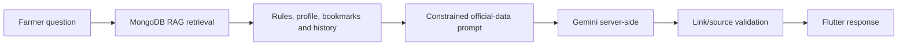

# Phase 5 – Verified AI Scheme Assistant

The Flutter client never calls Gemini. It sends an authenticated question to `POST /api/v1/chat` (the `/api/chat` alias is also available). The backend validates the input, loads the user's existing conversation, retrieves active MongoDB scheme records via the collection's text index, retrieves linked eligibility rules, farmer profile, matching bookmarks, and recent recommendation presence, then builds a constrained prompt. Gemini receives only that concise retrieved context and recent turns.

The prompt requires simple language and prohibits facts or links that are absent from the retrieved official records. If nothing is retrieved, Gemini is unavailable, or a response contains an unapproved link, the response is: `I couldn't find official information for that question.` This avoids fabricated scheme information.

## APIs

- `POST /chat` — question, optional conversation ID, language, scheme ID, and screen context.
- `POST /chat/stream` — compatibility chat endpoint; currently returns the same validated structured response rather than simulated client-side streaming.
- `GET` or `POST /chat/history` — list conversations or reopen one.
- `DELETE /chat/history` — delete one conversation or all caller history.
- `GET /chat/suggestions` — official-context-aware quick questions.

`chat_histories` stores message roles, content, source scheme IDs, approved official links, and timestamps. `chat_usage_logs` records server-side Gemini model, latency, and token usage. `GEMINI_API_KEY` stays only in backend environment configuration. Chat routes are authenticated and limited to 20 requests per 15 minutes per IP.

Set `GEMINI_API_KEY` and optionally `GEMINI_MODEL`, `GEMINI_API_BASE`, and `GEMINI_EMBEDDING_MODEL` in the backend environment before enabling production chat. The embedding service uses Gemini's server-side embedding endpoint and is isolated for a future vetted vector-index migration; current retrieval uses MongoDB's indexed official-record search.
