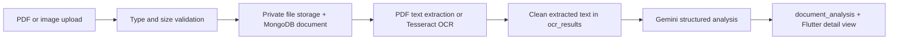

# Phase 6 – Secure Document Processing

The authenticated Flutter client selects a PDF, camera image, or gallery image and uploads it as multipart data to `POST /api/v1/pdf/upload` (the `/api/pdf` alias is also mounted). The server accepts only PDF, JPEG, and PNG files up to 10 MB, replaces unsafe filenames with generated storage names, and keeps uploads outside public static hosting.

Digital PDFs use `pdftotext`; scanned PDFs are rasterised with `pdftoppm` and each page is processed with Tesseract. Images are processed directly with Tesseract. Empty or unreadable files fail rather than receiving fabricated content. `PDFTOTEXT_PATH` and `PDFTOPPM_PATH` may be set where those binaries are not on PATH.

Gemini receives only extracted text, requests a strict JSON result, and fails safely if a valid analysis cannot be produced. Completed document hashes are reused for the same user, avoiding OCR or AI reprocessing of unchanged files.

Endpoints: `POST /pdf/upload`, `POST /pdf/analyze`, `GET /pdf/history?q=`, `GET /pdf/:id`, and `DELETE /pdf/:id`. History search is backed by MongoDB filename/text indexes. `documents`, `ocr_results`, and `document_analysis` retain upload metadata, text, analysis, and processing status.

`GET /checklist/:schemeId` combines official scheme requirements with completed user uploads. `POST /checklist/status` persists farmer-confirmed items, while upload matches remain dynamically detected.
